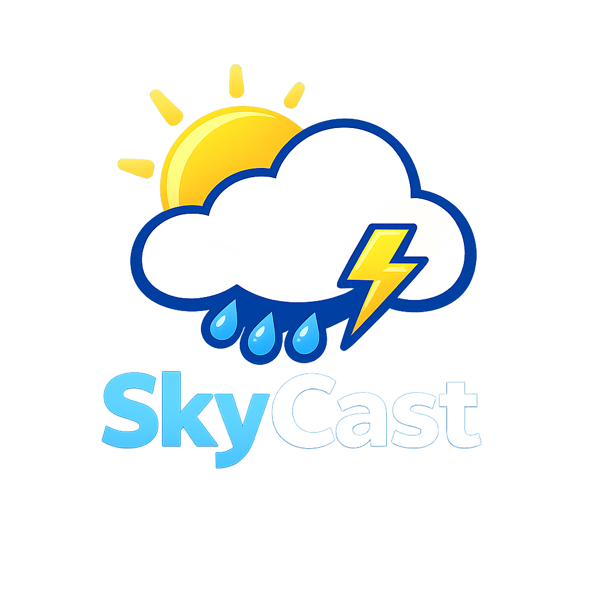

  

<h1 align="center">🌤 SkyCast</h1>

  A modern weather application built with Python, Flask, HTML, CSS, and JavaScript.

"Python" (https://img.shields.io/badge/Python-3-blue?logo=python)
"Flask" (https://img.shields.io/badge/Flask-Web_App-black?logo=flask)
"JavaScript" (https://img.shields.io/badge/JavaScript-ES6-yellow?logo=javascript)
"License" (https://img.shields.io/badge/License-MIT-green)

---

✨ Features

- 🌤 Current weather
- 📅 5-day forecast
- ⭐ Favorite cities
- 📱 Responsive design
- 🧩 Modular frontend architecture
- 🐍 Modular Flask backend
- 🔄 Git & GitHub version control

---

🛠 Built With

- Python 3
- Flask
- HTML5
- CSS3
- JavaScript (ES6)
- OpenWeather API
- Git
- GitHub

---

🚀 Installation

Clone the repository:

git clone https://github.com/JordieCornette4/SkyCast.git

Move into the project folder:

cd SkyCast

Install the required packages:

pip install -r requirements.txt

Start the application:

python app.py

Open your browser:

http://127.0.0.1:5000

---

📁 Project Structure

SkyCast/
├── app.py
├── config.py
├── requirements.txt
├── LICENSE
├── README.md
├── assets/
│   └── skycast-logo.png
├── skycast/
│   ├── __init__.py
│   ├── weather.py
│   └── forecast.py
├── static/
│   ├── style.css
│   ├── script.js
│   ├── images/
│   │   └── skycast-logo.png
│   └── js/
│       ├── api.js
│       ├── ui.js
│       ├── weather.js
│       ├── forecast.js
│       └── favorites.js
└── templates/
    ├── index.html
    └── 404.html

---

🗺 Roadmap

✅ Completed

- Current weather
- 5-day forecast
- Favorite cities
- Responsive interface
- Modular frontend
- Modular backend

🚀 Planned

- 📍 Use My Location
- 🌙 Dark Mode
- 🔍 Recent Searches
- 🌦 Animated weather backgrounds
- 📱 Progressive Web App (PWA)
- ⚠️ Weather alerts

---

🤝 Contributing

Contributions, suggestions, bug reports, and improvements are welcome.

---

📄 License

This project is licensed under the MIT License.

---

👨‍💻 Developer

Created and maintained by Jordie Cornette.

GitHub: https://github.com/JordieCornette4
